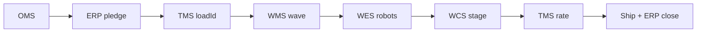

# Omni-Channel End to End Integration

**Portfolio** — multi-warehouse supply chain integration platform.

| | |
|--|--|
| **Product Brief** | **[PRODUCT_BRIEF.md](PRODUCT_BRIEF.md)** — pitch, demo script, STAR stories, metrics |
| **Demo** | [http://localhost:8080/ui/guide](http://localhost:8080/ui/guide) |
| **Repo** | [github.com/bharat2476/Integration](https://github.com/bharat2476/Integration) |
| **Engineering detail** | [docs/TECH.md](docs/TECH.md) |

```powershell
cd 3-saas-application; npm install; npm run dev
```

---

## Product

Customer orders touch **OMS, ERP, WMS, WES, WCS, and TMS**—each a complex system with its own APIs. Product is the **orchestration layer** that chains those APIs so fulfillment runs end-to-end without manual re-entry. We built **IaaS + SaaS as a shared platform** for every warehouse, ship with **Docker via Jenkins**, and add **Terraform-managed VMs** on peak demand—not a one-off integration per building.

---

## Why this matters

| Problem | Product answer |
|---------|----------------|
| Systems don’t talk | One flow, one correlation ID across partners |
| Rush orders miss SLA | Priority score, RUSH waves, expedited TMS |
| Wrong dock / trailer | **TMS load ID before WMS releases pick** |
| Peak breaks ops | Shared platform + burst capacity (Terraform/Karpenter) |
| New site = new project | Same APIs; Edge config only for local WES/WCS |

---

## Order Flow



| Step | System | Customer-visible |
|------|--------|------------------|
| 1 | OMS | Order confirmation |
| 2 | ERP | — |
| 3 | **TMS** | — (load + lane + trailer assigned) |
| 4 | WMS | — |
| 5 | WES / WCS | — |
| 6 | TMS | Tracking |
| 7 | WMS + ERP | Shipped |

**Rush** ~24h ship target · **Standard** ~5 days — different wave tier and freight.

---

## Platform strategy

| Layer | Shared across warehouses | Per site |
|-------|--------------------------|----------|
| **SaaS** | Order, catalog, inventory APIs; one **Docker** image | Edge floor endpoints |
| **PaaS** | Helm, gateway, observability | Values / profile |
| **IaaS** | Terraform, EKS, **peak VM burst** | Region |

**Global (cloud):** OMS, ERP, TMS, WMS orchestration for the shared estate.  
**Edge (on-prem):** WES + WCS for speed and vendor choice.

**Delivery:** Jenkins + GitHub Actions → Docker image → canary → all sites.  
**Peak:** Terraform baseline nodes + Karpenter burst + API autoscale.

---

## Demo

1. [Product Guide](http://localhost:8080/ui/guide) — narrative  
2. [Orders](http://localhost:8080/ui/orders) — rush vs standard; show `tmsLoadId`  
3. [Warehouse](http://localhost:8080/ui/warehouse) — floor + robotics  
4. [Inventory](http://localhost:8080/ui/inventory) — reconciliation / OS&D  
5. [Platform](http://localhost:8080/ui/platform) — multi-DC platform view  

---

## Outcomes

- SLA hit rate (rush vs standard)  
- Integration reliability by stage  
- Time to onboard a new DC  
- Infra cost per order at peak  
- Audit quality (OS&D, WMS vs ERP)  

---

## For engineers

| Topic | Link |
|-------|------|
| APIs, pipeline states, CI/CD | [docs/TECH.md](docs/TECH.md) |
| `AGENTS.md` | Agent / operator quick reference |

---

## License

Apache-2.0 (configure per enterprise policy).
