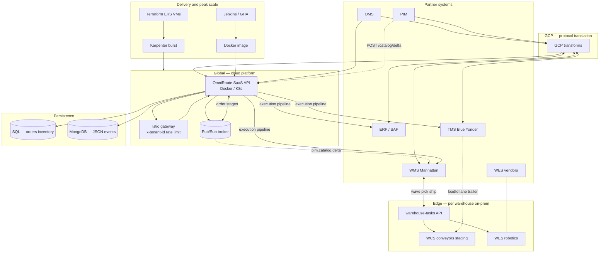
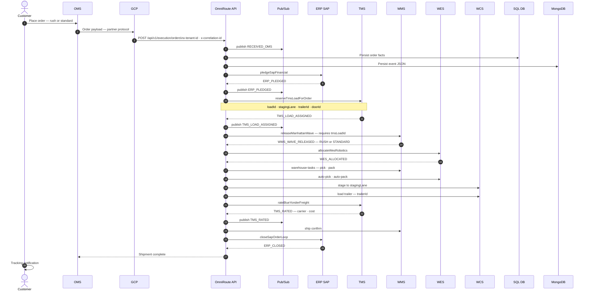

# Omni-Channel End-to-End Integration

🔗 **[Live demo →](http://localhost:8080/ui/guide)** · **[GitHub →](https://github.com/bharat2476/Integration)** · **[Engineering deep-dive →](docs/TECH.md)**

---

## Why This Was Built

**Situation:** A multi-DC retail operation was running six systems — OMS, ERP, TMS, WMS, WES, and WCS — each with its own API estate, each integrated separately per building. Every new distribution center meant a new custom project. Rush orders were missing SLA because pick was releasing before TMS had assigned a staging lane and trailer. Dock assignment errors were causing fulfillment failures at peak.

**Task:** Design a single orchestration layer that chains all six systems in the correct sequence, enforces business rules (TMS load before WMS pick, rush vs. standard priority routing), and scales across warehouses without per-DC custom engineering.

**Actions:** Built a shared SaaS API platform — one Docker image deployed via Jenkins, scaled on peak with Terraform + Karpenter — with global cloud components for OMS, ERP, TMS, and WMS, and a lightweight Edge layer for on-prem WES and WCS per site. Every request carries a `correlationId` across all six systems.

**Result:** One platform, many distribution centers. TMS load ID assigned before every pick release. Rush orders routed through priority waves with expedited freight. New DCs onboarded via Edge config — not a new project. Peak capacity handled via shared Terraform burst, not per-building infrastructure.

---

## Stack

**Java / Spring Boot** · **Docker** · **Kubernetes (EKS)** · **Helm** · **Jenkins / GitHub Actions** · **Terraform + Karpenter** · **Google Cloud Pub/Sub** · **Istio gateway** · **SQL** (orders, inventory) · **MongoDB** (JSON event audit) · **GCP transforms** (protocol translation) · **Splunk** (observability)

**Integrated systems:** OMS · ERP (SAP) · TMS (Blue Yonder) · WMS (Manhattan) · WES (Locus, AutoStore, and others) · WCS · PIM

---

## Key Decisions & Trade-offs

| Decision | Why | Trade-off accepted |
|---|---|---|
| **TMS load ID required before WMS pick release** | Staging lane and trailer must exist before pick begins — otherwise dock assignment fails at the floor | Adds a synchronous TMS call in the critical path; acceptable because TMS response is fast and the cost of a dock error is far higher |
| **Single Docker image across all DCs** | Eliminates per-building engineering; new DC = Edge config, not a new project | Global image must handle all WES/WCS vendor variants via Edge abstraction |
| **Edge layer for WES and WCS (on-prem)** | WES robotics and WCS conveyors are latency-sensitive and often air-gapped; cloud round-trips would cause floor failures | Edge must be maintained per site; adds deployment surface area |
| **Pub/Sub for stage events, sync pipeline for execution** | Order execution (ERP pledge → TMS load → WMS wave) is synchronous for auditability and SLA tracking; status broadcasting is async to avoid blocking | Two communication patterns to maintain; tradeoff is clarity of failure isolation |
| **`correlationId` across all six systems** | Single audit thread for debugging, OS&D resolution, and WMS vs. ERP reconciliation — without it, cross-system failures are opaque | Requires all partner integrations to propagate the ID; enforced at the gateway |
| **Terraform + Karpenter for peak burst** | Shared platform means peak capacity is a platform problem, not a per-DC problem; Karpenter node provisioning is faster than pre-warming | Requires IaC discipline and burst budget governance |
| **PIM async — never blocks orders** | Catalog delta sync is low-urgency; decoupling it from the order pipeline prevents a PIM outage from impacting fulfillment | SKU cache at the warehouse may lag by minutes; acceptable for catalog, not for inventory |

---

## Problem → Product Answer

| Pain | Answer |
|------|--------|
| Six systems, six API estates | One flow, one `correlationId` |
| Rush orders miss SLA | `priorityScore`, RUSH waves, expedited TMS routing |
| Wrong dock / trailer | TMS load → WCS staging lane → correct trailer |
| Peak weeks break per-DC infra | Shared platform + Terraform / Karpenter burst |
| New DC = new integration project | Same APIs; Edge config for local WES/WCS only |

---

## Systems Integrated

| System | Role | When in the flow |
|--------|------|-----------------|
| **OMS** | Orders, rush vs. standard classification | Ingest |
| **ERP (SAP)** | Financial pledge, ledger, close | Start and end of flow |
| **TMS (Blue Yonder)** | **Load ID**, staging lane, trailer; then freight rating | **Before WMS** — this is the critical ordering rule |
| **WMS (Manhattan)** | Waves, pick, pack, ship confirm | After TMS load is assigned |
| **WES** | Robotics orchestration (Locus, AutoStore, and others) | Per site, per wave |
| **WCS** | Staging lane, conveyor, trailer load | Uses TMS lane and trailer ID |
| **PIM** | Product catalog delta sync | Async — never blocks order flow |

---

## Data Flow

End-to-end movement of **orders**, **catalog**, and **inventory** through the shared platform (Global cloud + Edge warehouses). Every request carries `x-tenant-id` and `x-correlation-id`.



| Flow | Path | Async? |
|------|------|--------|
| **Order** | OMS → GCP → API → ERP → **TMS load** → WMS → WES → TMS rate → ERP close | Sync pipeline + stage events on Pub/Sub |
| **Catalog** | PIM → API → `pim.catalog.delta` → warehouse SKU cache | Yes — does not block orders |
| **Floor** | API `warehouse-tasks` → WMS / WES / WCS (uses `tmsLoadId`, `stagingLane`) | Edge, low latency |
| **Inventory** | Cycle count / reconciliation / OS&D → SQL + MongoDB audit | Finance alignment |

---

## Order Sequence — The Critical Path

**The rule:** TMS assigns **load ID** (staging lane + trailer) **before** WMS releases pick. Rush vs. standard changes SLA, wave tier, and freight class.



**API response** (`POST /api/v1/execution/orders`): `tmsLoadId` · `stagingLane` · `trailerId` · `doorId` · `priorityScore` · `promisedShipBy` · `waveTier`

| Priority | SLA |
|----------|-----|
| **Rush** | ~24 hours |
| **Standard** | ~5 days |

---

## Platform Architecture

```
Many DCs → Shared SaaS API (Docker) ← Jenkins / GitHub Actions
              Global: OMS · ERP · TMS · WMS
              Edge:   WES · WCS (on-prem per site)
              Terraform + Karpenter (peak burst nodes)
```

| Layer | Shared across all DCs | Per site only |
|-------|----------------------|---------------|
| **SaaS** | Order, catalog, inventory APIs; one Docker image | Edge floor APIs |
| **PaaS** | Helm charts, Istio gateway, Splunk observability | Helm values per site |
| **IaaS** | Terraform, EKS, Karpenter burst nodes | Region / VPC |

---

## Outcomes

| Outcome | How it's enforced |
|---------|------------------|
| On-time delivery | SLA enforcement + rush priority routing |
| Dock accuracy | TMS load assigned before every pick release |
| Peak readiness | Terraform + Karpenter + HPA — shared burst, not per-DC |
| Cost efficiency | One platform across all distribution centers |
| Safe releases | Jenkins/GHA pipeline + tenant smoke tests + canary deploys |
| Audit and reconciliation | OS&D codes; WMS vs. ERP ledger reconciliation via SQL + MongoDB |

**Metrics tracked:** SLA hit rate · failures by pipeline stage · time to onboard a new DC · cost per million orders · OS&D cycle time

---

## What This Demonstrates — And What It Intentionally Omits

| What this demonstrates | What it intentionally omits |
|---|---|
| Cross-system orchestration design across six enterprise APIs | Production credentials and live partner system connections |
| Correct sequencing of TMS → WMS as an enforced business rule | Real-time robotics integration (WES vendor-specific protocols simulated) |
| Multi-DC platform thinking: one image, many buildings | Full Terraform IaC for a production EKS cluster |
| Pub/Sub event architecture for stage broadcasting | High-volume load testing and p99 latency benchmarks |
| Rush vs. standard priority routing end-to-end | Carrier rate negotiation logic (TMS rating is stubbed) |

---

## Demo Script (6 minutes)

| Min | Screen | What to show |
|-----|--------|-------------|
| 0–1 | [/ui/guide](http://localhost:8080/ui/guide) | Six systems, one flow — the business problem and the platform answer |
| 1–2 | [/ui/orders](http://localhost:8080/ui/orders) — **rush** | `tmsLoadId` in the JSON response — TMS assigned before WMS wave |
| 2–3 | [/ui/orders](http://localhost:8080/ui/orders) — **standard** | Lower `priorityScore`, STANDARD wave tier, longer SLA |
| 3–4 | [/ui/warehouse](http://localhost:8080/ui/warehouse) | WMS wave → WES robotics → WCS staging lane → trailer load |
| 4–5 | [/ui/inventory](http://localhost:8080/ui/inventory) | WMS vs. ERP reconciliation; OS&D codes and audit trail |
| 5–6 | [/ui/platform](http://localhost:8080/ui/platform) | Multi-DC platform view; Jenkins pipeline; Terraform burst |

**Key moment:** On the rush order response, point to `tmsLoadId` appearing before `WMS_WAVE_RELEASED` in the event sequence. That ordering is the core business rule — and the core engineering constraint — this platform enforces.

---

## Interview Framing

### Architecture principles

- **Correct sequencing as a platform guarantee** — TMS load before WMS pick is not a convention; it is enforced in the execution pipeline and cannot be bypassed
- **Platform over project** — the shift from per-DC custom integration to a shared SaaS model is the central product decision; new DCs are a config problem, not an engineering problem
- **Edge for latency, cloud for coordination** — WES and WCS are on-prem because floor latency requirements and air-gap constraints demand it; everything that can be global, is
- **Correlation ID as the audit spine** — cross-system debugging, OS&D resolution, and financial reconciliation all depend on a single thread through every system

### Key trade-offs for discussion

- **Synchronous execution pipeline vs. async event broadcasting** — execution is sync for auditability; status is async to avoid blocking. The boundary between these is a deliberate design choice, not an accident
- **One image vs. per-DC customization** — shared image reduces ops burden but requires WES/WCS abstraction to handle vendor differences at the Edge
- **TMS in the critical path** — adding a synchronous TMS call before pick increases latency slightly; the alternative (dock errors, repack, trailer reassignment) is far more expensive
- **Peak as a platform problem** — Karpenter burst is shared, so peak at one DC doesn't require pre-warming at every DC; the trade-off is shared blast radius if burst capacity is exhausted

---

## For Engineers

Full API reference, pipeline state machine, CI/CD runbook, and environment setup: **[docs/TECH.md](docs/TECH.md)**

Operator notes and agent runbook: **[AGENTS.md](AGENTS.md)**

---

## License

Apache-2.0 — configure per enterprise policy.
