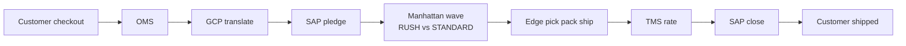
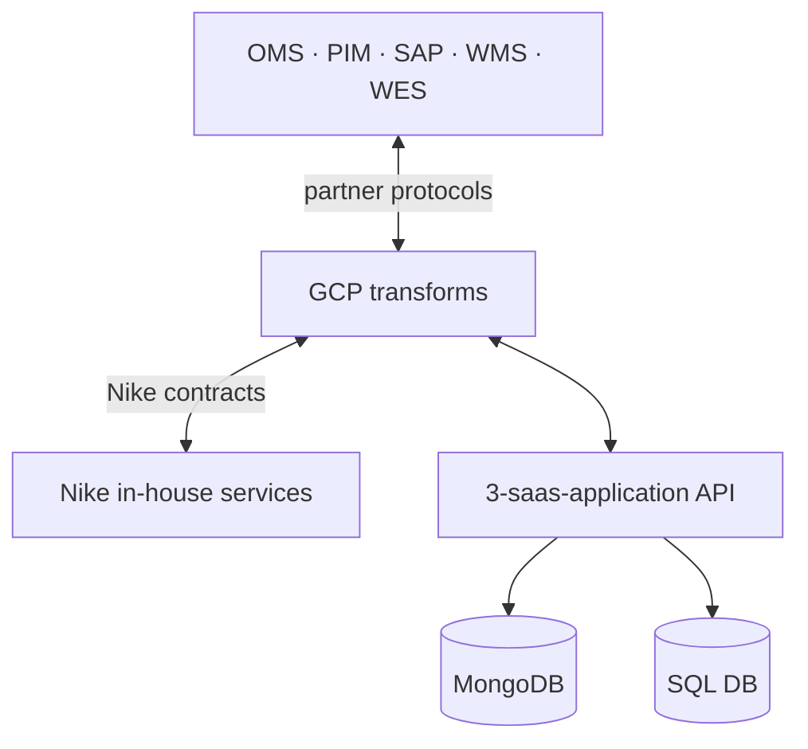
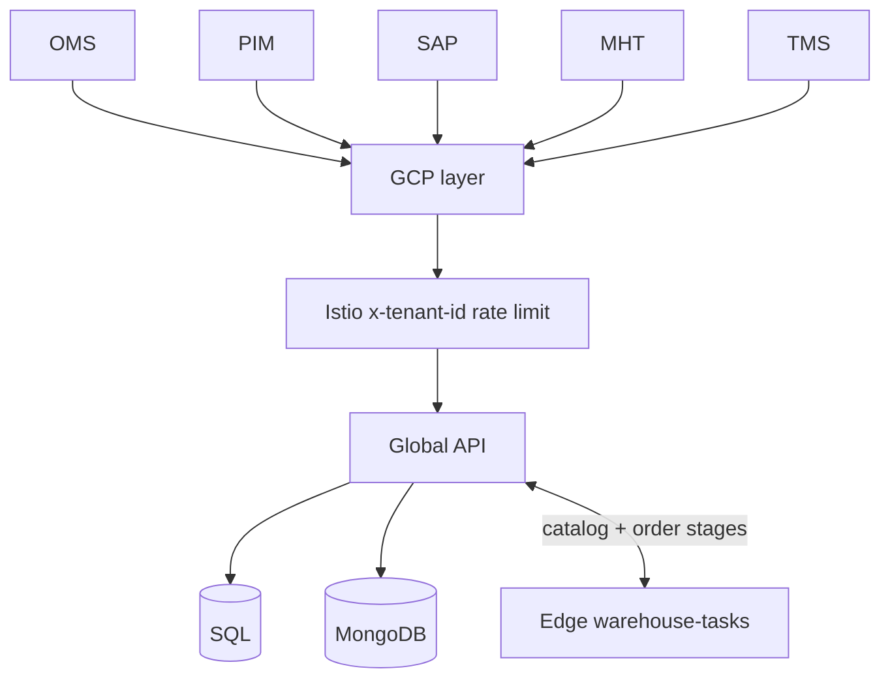
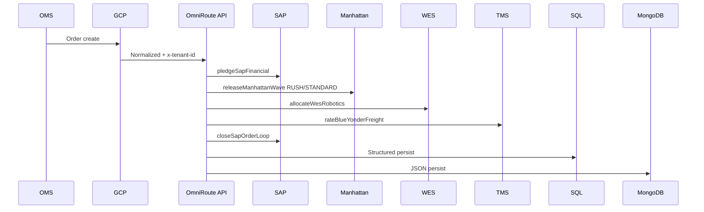
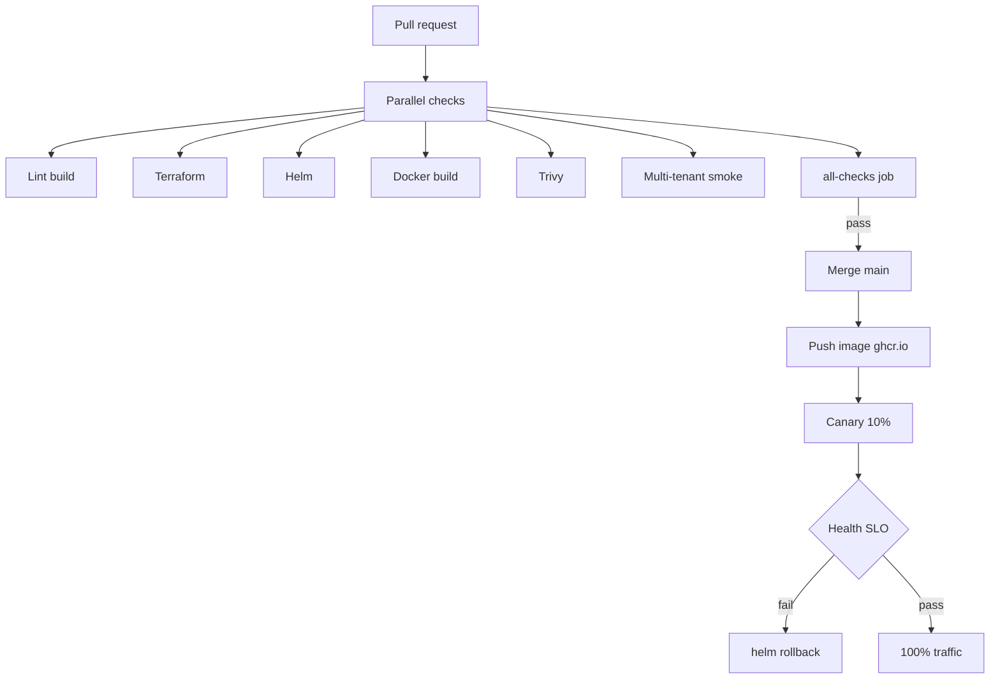

# Omni-Channel End to End Integration

**Omni-Channel End to End Integration** (OmniRoute-Core in code) is a production-ready architectural blueprint for a decoupled, multi-tenant supply chain abstraction layer. It connects **OMS**, **PIM**, **SAP ERP**, **Manhattan WMS**, **WES** (AutoStore, Vanderlande, Locus, Schaefer, Rapyuta), and **Blue Yonder TMS** — so a **customer order** moves from checkout to on-time delivery without tight coupling between domain systems.

Repository: [github.com/bharat2476/Integration](https://github.com/bharat2476/Integration)

**Local dev UI:** [http://localhost:8080/ui/guide](http://localhost:8080/ui/guide) (after `npm run dev` in `3-saas-application`)

## Choose your view

Pick the guide that matches how you work:

| Persona | Best for | Jump to |
|---------|----------|---------|
| **Non Tech** | Business stakeholders, operations leaders, finance/legal reviewers, first-time demos | **[Non Tech Persona →](#non-tech-persona)** |
| **Tech** | Engineers, architects, platform teams, CI/CD operators | **[Tech Persona →](#tech-persona)** |

---

## Non Tech Persona

> **OmniRoute-Core — explained simply**  
> Think of this as the **coordination layer** between your selling website, finance system, warehouse, robots, and carriers. It is not a replacement for Manhattan or SAP — it is the **glue** that keeps them aligned so the customer gets the right product on time.

### Live demo (start here)

Open the in-app **Product Guide** and linked screens (local):

| Screen | URL |
|--------|-----|
| **Product Guide** | [http://localhost:8080/ui/guide](http://localhost:8080/ui/guide) |
| Order execution (rush vs standard) | [http://localhost:8080/ui/orders](http://localhost:8080/ui/orders) |
| PIM catalog | [http://localhost:8080/ui/catalog](http://localhost:8080/ui/catalog) |
| Warehouse tasks | [http://localhost:8080/ui/warehouse](http://localhost:8080/ui/warehouse) |
| Inventory & OS&D | [http://localhost:8080/ui/inventory](http://localhost:8080/ui/inventory) |
| Global / Edge / Data | [http://localhost:8080/ui/platform](http://localhost:8080/ui/platform) |
| Health & metrics | [http://localhost:8080/ui/health](http://localhost:8080/ui/health) |

```powershell
cd C:\Users\agarw\Integrations\3-saas-application
npm install
npm run dev
```

### Main objective — customer order to on-time delivery

When a **customer places an order**, the platform’s job is the **end-to-end fulfillment journey**:

1. Accept the order from the selling channel by ensuring inventory exists and route it to closest warehouse to keep shipping costs low (OMS).
2. Confirm finance can support the shipment (SAP).
3. Release work to the warehouse (Manhattan WMS).
4. Run floor and robot tasks at the building (Edge — on-prem).
5. Book the right carrier service (Blue Yonder TMS).
6. Close the books and confirm shipment (SAP).

Every step shares the same **tracking ID** internally so support teams can see where a delay happened.

### Rush vs standard (priority)

| Priority | Typical promise (demo) | What happens behind the scenes |
|----------|------------------------|--------------------------------|
| **Rush / urgent** | ~24 hour ship target | Jumps ahead in the warehouse queue (**RUSH** wave), expedited shipping, robots prioritized |
| **Standard / non-rush** | ~5 day ship target | Normal queue; fills capacity between urgent orders |

Urgent orders are **not** treated the same as routine orders — the warehouse and carriers get a higher priority signal so promised dates are met.



### The customer journey (step by step)

```
Customer checks out  →  Finance OK  →  Warehouse wave  →  Pick / pack / ship  →  Carrier  →  Customer notified
```

| Step | What the customer sees | What the business does (systems) |
|------|------------------------|----------------------------------|
| 1 | Order confirmation | Order captured in OMS; translated via **GCP** to internal Nike protocols |
| 2 | — | SAP pledges inventory / funds |
| 3 | — | Manhattan releases a **priority wave** (rush first) |
| 4 | — | Edge site: pick, pack, robots, label |
| 5 | Tracking number | TMS rates express vs ground by urgency |
| 6 | “Shipped” email | Ship confirm + SAP financial close |

**Why so many systems?** Each owns one job (money, physical stock, robots, trucks). OmniRoute-Core orchestrates them so teams do not re-type orders or lose time during peak weeks.

### Two parts: Global (cloud) and Edge (warehouse)

| Part | Where it runs | What it does |
|------|---------------|--------------|
| **Global** | Shared **cloud** (multi-region) | Same WMS estate for all brands: orders, catalog, finance, carriers |
| **Edge** | **On-prem** at each warehouse | Fast local actions: waves, picks, AMRs, labels — different robot vendors per building |

Edge stays in the building so scanners and robots stay **fast**. Global stays in the cloud so one integration serves every tenant and region.

### Where data lives (plain language)

| Store | Holds |
|-------|--------|
| **SQL database** | Structured facts — order lines, quantities, reconciliation |
| **MongoDB** | JSON payloads — large catalog files, audit documents, event detail |
| **GCP** | Translates messages **to and from Nike in-house service protocols** |

**PostgreSQL was not used** for this production integration.

### How the team ships changes safely (CI/CD)

Many engineers work in parallel. **Bad changes do not merge to `main`** until automated checks pass:

- **Docker image** builds correctly (same packaging as production).
- **Security scan** blocks critical image issues.
- **Multi-tenant tests** ensure every API call includes a tenant ID and tenants do not mix.
- **Merge gate** — all checks must be green before code joins `main`.

Only after merge does the new Docker image deploy (canary → health check → full rollout or automatic rollback).

### Business outcomes

| Outcome | How the platform helps |
|---------|-------------------------|
| On-time delivery | SLA clock + rush priority on every order |
| Lower cost | Shared cloud resources; Edge only where speed requires it |
| Resilience | Multiple regions; warehouse can keep working if one cloud region blips |
| Audit & compliance | OS&D reason codes; finance/legal flags on adjustments |

### Who benefits

**Operations** — Clear floor actions (release wave, pick, ship), Splunk views for errors by robot vendor, rush vs standard visibility.

**Finance & Legal** — Daily WMS vs SAP reconciliation; overage/shortage/damage adjustments with audit trail and legal hold on damage.

### The big picture

```
Customer order (OMS)
    → GCP (Nike protocol translation)
    → Global coordination (SAP · Manhattan · TMS)
    → Edge warehouse (pick · pack · robots · ship)
    → Finance close + inventory hygiene
    → Dashboards (latency · errors · SLA)
```

### What this product is — and is not

| It is | It is not |
|-------|-----------|
| An **integration orchestration** platform | A replacement WMS or ERP |
| **Multi-tenant** and **multi-region** in the cloud | One database for everything (uses SQL + MongoDB) |
| Built for **peak volume** and **rush priority** | A single-warehouse-only tool |
| **Edge on-prem** where latency matters | All processing in the cloud only |

### One-sentence summary

**OmniRoute-Core coordinates customer orders across OMS, finance, warehouse, robotics, and shipping — prioritizing urgent orders, meeting delivery promises, and leaving a clear audit trail — while translating all traffic through GCP to Nike in-house services.**

### 5-minute try path

1. [Product Guide](http://localhost:8080/ui/guide) — read the walkthrough  
2. [Orders](http://localhost:8080/ui/orders) — run one **rush** and one **standard** order  
3. [Warehouse](http://localhost:8080/ui/warehouse) — print a sample label  
4. [Inventory](http://localhost:8080/ui/inventory) — view audit ledger  

Need architecture, Terraform, Helm, CI/CD job names, and API contracts? Switch to the **[Tech Persona →](#tech-persona)** guide.

[↑ Back to Choose your view](#choose-your-view)

---

## Tech Persona

Technical reference for engineers, architects, and platform operators. Covers three-pillar architecture, GCP/Nike protocol bridge, MongoDB + SQL data plane, workflows, CI/CD (Docker + multi-tenant gates), and runbooks.

**Quick jump:**

| Topic | Section |
|-------|---------|
| Data platform (MongoDB, SQL, GCP) | [Data platform](#data-platform-mongodb-sql-and-gcp-nike-protocol-bridge) |
| Global vs Edge | [Integration topology](#integration-topology-global-vs-edge) |
| Architecture (3 pillars) | [Architecture diagram](#architecture-diagram-three-pillars--artifacts) |
| Order / catalog workflows | [Workflows A–D](#workflow-a--pim-catalog-pubsub) |
| CI/CD & Docker | [CI/CD](#cicd--docker-images-multi-tenant-gates-and-safe-merges-to-main) |
| Run locally | [Quick start](#quick-start) |

> **Production data:** **MongoDB** (JSON / unstructured), **SQL** (structured). **GCP** translates to/from **Nike in-house service protocols**. **PostgreSQL was not used.** `1-iaas-infra/terraform/rds.tf` is an optional AWS reference sample only.

### Local dev UI

| Page | URL |
|------|-----|
| Product Guide | [http://localhost:8080/ui/guide](http://localhost:8080/ui/guide) |
| Overview (API console) | [http://localhost:8080/](http://localhost:8080/) |
| Order execution | [http://localhost:8080/ui/orders](http://localhost:8080/ui/orders) |
| PIM catalog | [http://localhost:8080/ui/catalog](http://localhost:8080/ui/catalog) |
| Warehouse tasks | [http://localhost:8080/ui/warehouse](http://localhost:8080/ui/warehouse) |
| Inventory & OS&D | [http://localhost:8080/ui/inventory](http://localhost:8080/ui/inventory) |
| Global / Edge / Data | [http://localhost:8080/ui/platform](http://localhost:8080/ui/platform) |
| Health & metrics | [http://localhost:8080/ui/health](http://localhost:8080/ui/health) |

---

### Data platform: MongoDB, SQL, and GCP (Nike protocol bridge)

| Store | Data profile | Examples |
|-------|--------------|----------|
| **MongoDB** | Semi-structured / JSON | PIM deltas, raw partner payloads, OS&D audit docs, pub/sub bodies |
| **SQL DB** | Structured relational | Order headers/lines, inventory ledger, reconciliation |
| **GCP** | Protocol translation | Nike in-house schema mapping inbound/outbound |



---

### Integration topology: Global vs Edge

| Component | Deployment | Scope | Repo focus |
|-----------|------------|-------|------------|
| **Global** | Multi-region EKS | Shared Manhattan estate; OMS/PIM/SAP/TMS | `1-iaas-infra/`, `2-paas-platform/`, `catalog/`, `execution/`, `inventory/` |
| **Edge** | On-prem per DC | Site WES vendors (Locus, AutoStore, …) | `warehouse-tasks/` |



See also: [Shared resources](#shared-resources-and-cost-efficiency), [Multi-region](#multi-region-placement-avoid-disruption), [Engineer-driven scalability](#engineer-driven-scalability-config-not-heroics).

---

### Shared resources and cost efficiency

| Shared resource | Cost control | Artifact |
|-----------------|--------------|----------|
| EKS cluster | One regional plane | `terraform/eks.tf` |
| Karpenter | Spot + on-demand burst | `karpenter/nodepool-workloads.yaml` |
| Helm | One chart, all tenants | `helm/omniroute-api/` |
| SQL + MongoDB | Pooled stores, tenant isolation | Production tiers |
| OTel → Splunk | Shared observability | `otel/`, `splunk/dashboard-*.json` |
| CI/CD | One pipeline, all pillars | `.github/workflows/deploy.yml` |

Istio per-tenant rate limits: `gateway/istio/envoyfilter-tenant-ratelimit.yaml`.

---

### Multi-region placement (avoid disruption)

Separate VPC + EKS + data replicas per region; Edge warehouses continue on-prem if a cloud region fails. Parameterize via `var.aws_region` and Helm `values.yaml` per region.

---

### Engineer-driven scalability (config, not heroics)

| Knob | Artifact | Effect |
|------|----------|--------|
| Karpenter limits | `nodepool-workloads.yaml` | Peak CPU/memory ceiling |
| HPA + queue depth | `helm/omniroute-api/values.yaml` | Scale on `omniroute_pubsub_backlog_depth` |
| Istio token bucket | EnvoyFilter | Noisy-neighbor isolation |
| Canary weight | `deploy.yml` | Safe rollout / rollback |

---

### Architecture diagram (three pillars + artifacts)

```mermaid
flowchart TB
  subgraph paas [2-paas-platform]
    GW[Istio EnvoyFilter]
    HELM[Helm omniroute-api + HPA]
    OTEL[OTel DaemonSet]
    SPL[Splunk dashboard]
  end
  subgraph saas [3-saas-application]
    API[Express :8080]
    PS[pubsub/broker.ts]
    CAT EXEC WH INV[domain modules]
    PORTAL[dev-portal/]
  end
  subgraph iaas [1-iaas-infra]
    VPC[vpc.tf]
    EKS[eks.tf + Karpenter]
  end
  clients[OMS PIM SAP MHT WES TMS] --> GW --> HELM --> API
  API --> PS & CAT & EXEC & WH & INV
  API --> OTEL --> SPL
```

| Layer | Path | Key artifacts |
|-------|------|----------------|
| **IaaS** | [`1-iaas-infra/`](1-iaas-infra/) | `vpc.tf`, `eks.tf`, `karpenter.tf`, `outputs.tf` |
| **PaaS** | [`2-paas-platform/`](2-paas-platform/) | `helm/omniroute-api/`, `gateway/istio/`, `otel/`, `splunk/` |
| **SaaS** | [`3-saas-application/`](3-saas-application/) | `src/pubsub/`, `catalog/`, `execution/`, `warehouse-tasks/`, `inventory/`, `Dockerfile` |
| **CI/CD** | repo root | `deploy.yml`, `Jenkinsfile` |

---

### System workflow — all integrations and artifacts

`correlationId` on every hop — `src/shared/correlation.ts`.



**Order API:** `POST /api/v1/execution/orders` with `"shipUrgency": "rush" | "standard"` → returns `priorityScore`, `promisedShipBy`, `waveTier`.

---

### Workflow A — PIM catalog (pub/sub)

`pim-broker-client.ts` → topic `pim.catalog.delta` → `warehouse-subscriber.ts` (non-blocking fan-out).

---

### Workflow B — Order execution (OMS → ERP → WMS → WES → TMS → ERP)

`execution/routes.ts` → `order-pipeline.ts` → `integrations.ts` → `execution/priority.ts` (SLA + wave tier).

| State | System | Code |
|-------|--------|------|
| `ERP_PLEDGED` | SAP | `integrations.ts` |
| `WMS_WAVE_RELEASED` | Manhattan | `releaseManhattanWave(waveTier, queueRank)` |
| `WES_ALLOCATED` | WES vendor | `order-pipeline.ts` |
| `TMS_RATED` | Blue Yonder | `integrations.ts` |
| `ERP_CLOSED` | SAP | `closeSapOrderLoop` |

---

### Workflow C — Warehouse floor

`warehouse-tasks/routes.ts` — wave, pick, pack, auto-pick, labels (ZPL/PDF), ship.

---

### Workflow D — Inventory & OS&D

`inventory/services.ts` — cycle count, daily reconciliation, adjustments with reason codes → topic `inventory.adjustment.posted` → SQL + MongoDB audit payload.

---

### CI/CD — Docker images, multi-tenant gates, and safe merges to `main`



| Check | Artifact |
|-------|----------|
| Lint & compile | `npm run build` |
| Docker build | `3-saas-application/Dockerfile` |
| Trivy | Fails on CRITICAL,HIGH |
| Multi-tenant | `scripts/ci-tenant-smoke.mjs` |
| Merge gate | Job `all-checks` — require on `main` |

```bash
cd 3-saas-application
npm run test:tenant
```

Docker push and deploy run on **`main` push only** (`build-push`, `deploy-canary`, `promote-full` jobs in [`.github/workflows/deploy.yml`](.github/workflows/deploy.yml)).

---

### Pub/Sub topic catalog

| Topic | Publisher | Consumer |
|-------|-----------|----------|
| `pim.catalog.delta` | `catalog/pim-broker-client.ts` | `catalog/warehouse-subscriber.ts` |
| `order.execution.stage` | `execution/order-pipeline.ts` | Observability |
| `inventory.adjustment.posted` | `inventory/services.ts` | Finance / Splunk |

---

### Three-pillar topology (summary)

| Pillar | Responsibility |
|--------|----------------|
| **IaaS** | VPC, EKS, Karpenter |
| **PaaS** | Helm, Istio, OTel, Splunk |
| **SaaS** | Catalog, execution, warehouse, inventory APIs + dev portal |

---

### Quick start

```powershell
cd C:\Users\agarw\Integrations\3-saas-application
npm install
npm run dev
```

```bash
curl -X POST http://localhost:8080/api/v1/execution/orders \
  -H "Content-Type: application/json" \
  -H "x-tenant-id: tenant-acme" \
  -H "x-correlation-id: $(uuidgen)" \
  -d '{"omsOrderRef":"OMS-10042","shipUrgency":"rush","wesVendor":"Locus"}'
```

---

### Project layout

```
├── 1-iaas-infra/terraform/     # VPC, EKS, Karpenter (optional rds.tf sample)
├── 2-paas-platform/            # Helm, Istio, OTel, Splunk
├── 3-saas-application/         # Express API, dev-portal/, scripts/ci-tenant-smoke.mjs
├── .github/workflows/deploy.yml
├── Jenkinsfile
├── AGENTS.md
└── README.md
```

Prefer a plain-language walkthrough? See **[Non Tech Persona →](#non-tech-persona)**.

[↑ Back to Choose your view](#choose-your-view)

---

## Documentation personas

| Persona | Description |
|---------|-------------|
| **[Non Tech Persona](#non-tech-persona)** | Customer order journey, rush vs standard, Global/Edge, UI demo paths — no code required |
| **[Tech Persona](#tech-persona)** | Architecture, workflows, artifacts, CI/CD, APIs, local runbook |

---

## License

Apache-2.0 (configure per your enterprise policy).
