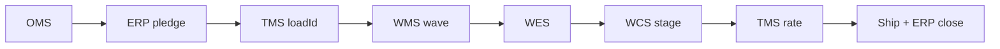

# Omni-Channel End to End Integration

**** — Multi-warehouse supply chain integration platform (portfolio / Director PM interview).

| | |
|--|--|
| **Repo** | [github.com/bharat2476/Integration](https://github.com/bharat2476/Integration) |
| **Live demo** | [http://localhost:8080/ui/guide](http://localhost:8080/ui/guide) |
| **Engineering** | [docs/TECH.md](docs/TECH.md) |

```powershell
cd 3-saas-application; npm install; npm run dev
```

---

**One orchestration layer, many warehouses.** OMS, ERP, WMS, WES, WCS, and TMS each have their own APIs—we chain them so orders ship on time without manual handoffs. **IaaS + SaaS built once**, delivered with **Docker (Jenkins)**, scaled on peak via **Terraform**—not a custom integration per building.

**Product rules:** (1) **TMS load ID before WMS pick** — staging lane + trailer before pick release. (2) **Rush vs standard** — SLA, wave tier, freight class.

---

## Problem → product answer

| Pain | Answer |
|------|--------|
| Six systems, six API estates | One flow, one `correlationId` |
| Rush orders miss SLA | `priorityScore`, RUSH waves, expedited TMS |
| Wrong dock / trailer | TMS load → WCS stage → correct trailer |
| Peak weeks | Shared platform + Terraform/Karpenter burst |
| New DC = new project | Same APIs; Edge config for local WES/WCS only |

---

## Systems integrated

| System | Role | When |
|--------|------|------|
| **OMS** | Orders, rush vs standard | Ingest |
| **ERP** | Pledge, ledger, close | Start / end |
| **TMS** | **Load ID**, lane, trailer; then freight | **Before WMS**; rate at ship |
| **WMS** | Waves, pick, ship | After load |
| **WES** | Robotics (Locus, AutoStore, …) | Per site |
| **WCS** | Staging, conveyors, trailer load | Uses TMS lane |
| **PIM** | Catalog | Async — never blocks orders |

---

## Order flow



**Rush** ~24h · **Standard** ~5d — different `waveTier`, carrier, and `priorityScore`. API: `POST /api/v1/execution/orders` → returns `tmsLoadId`, `stagingLane`, `trailerId`, `doorId`.

---

## Platform (all warehouses)

```
Many DCs → Shared SaaS API (Docker) ← Jenkins / GitHub Actions
              Global: OMS · ERP · TMS · WMS
              Edge: WES · WCS (on-prem)
              Terraform + Karpenter (peak VMs)
```

| Layer | Shared | Per site |
|-------|--------|----------|
| **SaaS** | Order, catalog, inventory APIs; one Docker image | Edge floor APIs |
| **PaaS** | Helm, gateway, Splunk | Helm values |
| **IaaS** | Terraform, EKS, burst nodes | Region |

---

## Outcomes

| Outcome | Mechanism |
|---------|-----------|
| On-time delivery | SLA + rush priority |
| Dock accuracy | TMS load → WCS |
| Peak readiness | Terraform + Karpenter + HPA |
| Cost | One platform, many DCs |
| Safe releases | Jenkins/GHA + tenant smoke + canary |
| Audit | OS&D codes; WMS vs ERP reconciliation |

**Metrics:** SLA hit rate · failures by stage · time to onboard a DC · cost per million orders · OS&D cycle time.

---

## Demo

| Min | Screen | Say |
|-----|--------|-----|
| 0–1 | [/ui/guide](http://localhost:8080/ui/guide) | Six systems, one flow |
| 1–2 | [/ui/orders](http://localhost:8080/ui/orders) — **rush** | TMS `tmsLoadId` before WMS in JSON |
| 2–3 | Orders — **standard** | Lower priority, STANDARD wave |
| 3–4 | [/ui/warehouse](http://localhost:8080/ui/warehouse) | WMS / WES / WCS |
| 4–5 | [/ui/inventory](http://localhost:8080/ui/inventory) | WMS vs ERP reconciliation |
| 5–6 | [/ui/platform](http://localhost:8080/ui/platform) | Multi-DC platform, Jenkins, Terraform |

---

## Engineers

APIs, pipeline states, CI/CD: **[docs/TECH.md](docs/TECH.md)** · Operator notes: **[AGENTS.md](AGENTS.md)**

---

## License

Apache-2.0 (configure per enterprise policy).
