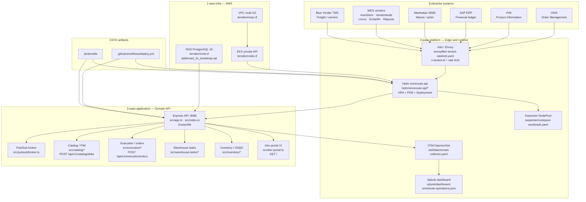
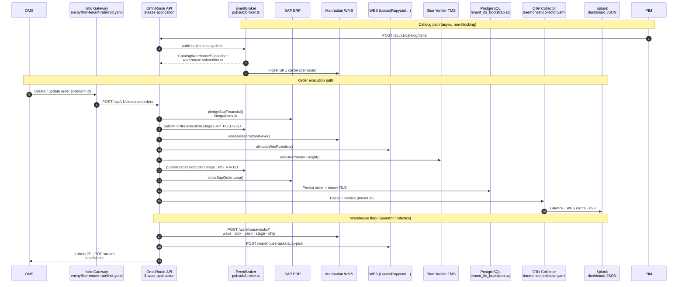
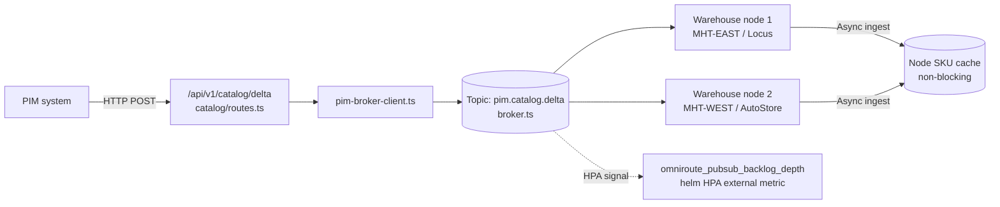
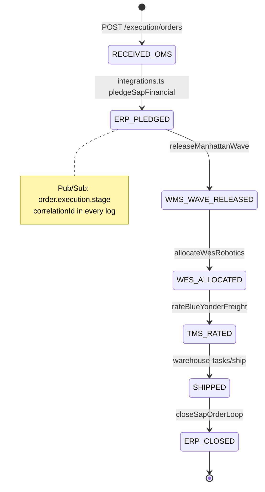
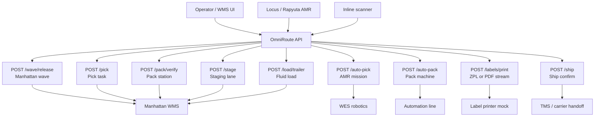
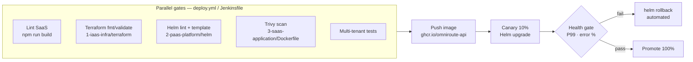

# OmniRoute-Core

**OmniRoute-Core** is a production-ready architectural blueprint for a decoupled, multi-tenant supply chain abstraction layer. It connects **OMS**, **PIM**, **SAP ERP**, **Manhattan WMS**, **WES** (AutoStore, Vanderlande, Locus, Schaefer, Rapyuta), and **Blue Yonder TMS** without tight coupling between domain systems.

Repository: [github.com/bharat2476/Integration](https://github.com/bharat2476/Integration)

**Local dev UI:** [http://localhost:8080/](http://localhost:8080/) (after `npm run dev` in `3-saas-application`)

---

## Architecture diagram (three pillars + artifacts)

End-to-end platform view: corporate traffic enters the PaaS edge, workloads run on IaaS, business logic lives in SaaS domains. Every box lists the **repository artifacts** that implement it.



| Layer | Path | Key artifacts |
|-------|------|----------------|
| **IaaS** | [`1-iaas-infra/`](1-iaas-infra/) | `terraform/vpc.tf`, `eks.tf`, `karpenter.tf`, `rds.tf`, `sql/tenant_rls_bootstrap.sql`, `outputs.tf` |
| **PaaS** | [`2-paas-platform/`](2-paas-platform/) | `helm/omniroute-api/`, `gateway/istio/envoyfilter-tenant-ratelimit.yaml`, `otel/daemonset-collector.yaml`, `splunk/dashboard-omniroute-operations.json`, `karpenter/nodepool-workloads.yaml` |
| **SaaS** | [`3-saas-application/`](3-saas-application/) | `src/pubsub/`, `src/catalog/`, `src/execution/`, `src/warehouse-tasks/`, `src/inventory/`, `src/shared/`, `Dockerfile` |
| **CI/CD** | repo root | [`.github/workflows/deploy.yml`](.github/workflows/deploy.yml), [`Jenkinsfile`](Jenkinsfile) |

---

## System workflow — all integrations and artifacts

Master sequence diagram: how an order and catalog change traverse **external systems**, **OmniRoute-Core**, **pub/sub topics**, **persistence**, and **observability artifacts**. `correlationId` is propagated on every hop (`src/shared/correlation.ts`).



---

## Workflow A — PIM catalog (pub/sub)

Massive catalog deltas must not block order pipelines. **Artifact chain:** `pim-broker-client.ts` → topic `pim.catalog.delta` → `warehouse-subscriber.ts`.



| Step | Artifact | Output |
|------|----------|--------|
| Ingest delta | `src/catalog/routes.ts` | `202` + `messageId` |
| Publish | `src/pubsub/broker.ts` | `PubSubMessage` + logs |
| Fan-out | `src/catalog/warehouse-subscriber.ts` | Per-node ingest logs |

---

## Workflow B — Order execution (OMS → ERP → WMS → WES → TMS → ERP)

Synchronous orchestration with async stage events. **Artifact chain:** `execution/routes.ts` → `order-pipeline.ts` → `integrations.ts`.



| Lifecycle state | External system | Code artifact |
|-----------------|-----------------|---------------|
| `ERP_PLEDGE_PENDING` / `ERP_PLEDGED` | SAP | `execution/integrations.ts` |
| `WMS_WAVE_RELEASED` | Manhattan | `execution/integrations.ts` |
| `WES_ALLOCATED` | AutoStore, Vanderlande, Locus, Schaefer, Rapyuta | `order-pipeline.ts` (`wesVendor`) |
| `TMS_RATED` | Blue Yonder | `execution/integrations.ts` |
| `ERP_CLOSED` | SAP close loop | `execution/integrations.ts` |
| Persisted | PostgreSQL RLS | `1-iaas-infra/terraform/sql/tenant_rls_bootstrap.sql` |

---

## Workflow C — Warehouse floor (manual + automation)

Maps HTTP endpoints to physical or robotic actions. **Artifact:** `warehouse-tasks/controllers.ts`, `warehouse-tasks/routes.ts`.



---

## Workflow D — Inventory, reconciliation, and OS&D (Finance / Legal)

**Artifacts:** `inventory/services.ts`, `inventory/routes.ts`, topic `inventory.adjustment.posted`, Splunk OS&D panel.

```mermaid
flowchart TB
  WH[Warehouse operator] --> CC[POST /inventory/cycle-count\nPerpetual baseline]
  FIN[Finance scheduler] --> DR[POST /inventory/reconciliation/daily\nWMS vs SAP ledger]
  QA[QA / inventory control] --> ADJ[POST /inventory/adjustments\nreasonCode validated]

  CC --> BASE[(perpetualBaseline map)]
  DR --> CMP{WMS qty = SAP qty?}
  CMP -->|mismatch| REP[Reconciliation report]
  ADJ --> OSD{Type: overage | shortage | damage}
  OSD --> AUD[AuditLedgerPayload\nfinanceReviewRequired · legalHold]
  AUD --> PS[(Topic: inventory.adjustment.posted)]
  AUD --> RDS[(tenant_shared.inventory_ledger\nRLS policy)]
  PS --> SPL[Splunk panel_osd_variance\ndashboard JSON]
```

| Adjustment type | Valid reason codes (sample) | Audit flags |
|-----------------|----------------------------|-------------|
| `overage` | `RCV-OVER`, `CNT-OVER`, `ADJ-OVER` | Finance review if \|Δ\| > 10 |
| `shortage` | `PICK-SHORT`, `CNT-SHORT`, `SHRINK` | Finance review if \|Δ\| > 10 |
| `damage` | `DMG-FREIGHT`, `DMG-HANDLING`, `DMG-QA` | `legalHold` on damage codes |

---

## CI/CD and deployment workflow (artifacts)



| Stage | Artifact | Behavior |
|-------|----------|----------|
| Quality gates | `.github/workflows/deploy.yml`, `Jenkinsfile` | Parallel lint, TF, Helm, Trivy |
| Canary | Helm `omniroute-api` | 10% traffic |
| Rollback | `deploy.yml` `deploy-canary` job | Simulated SLO breach → `helm rollback` |

---

## Pub/Sub topic catalog (SaaS artifacts)

| Topic | Publisher artifact | Subscriber / consumer |
|-------|-------------------|------------------------|
| `pim.catalog.delta` | `catalog/pim-broker-client.ts` | `catalog/warehouse-subscriber.ts` |
| `order.execution.stage` | `execution/order-pipeline.ts` | Observability / downstream analytics |
| `warehouse.task.completed` | *(reserved)* | WMS confirmation workers |
| `inventory.adjustment.posted` | `inventory/services.ts` | Finance audit, Splunk |

---

## Three-pillar topology (summary)

| Pillar | Path | Responsibility |
|--------|------|----------------|
| **IaaS** | [`1-iaas-infra/`](1-iaas-infra/) | AWS VPC (private isolation), EKS + Karpenter, RDS PostgreSQL with schema/RLS tenancy |
| **PaaS** | [`2-paas-platform/`](2-paas-platform/) | Helm HPA (queue-depth), Istio tenant rate limits, OTel → Splunk dashboards |
| **SaaS** | [`3-saas-application/`](3-saas-application/) | Catalog, order execution, warehouse tasks, inventory OS&D |

---

## Cross-functional collaboration

### Engineering & Platform

- **Pub/Sub decoupling** (`3-saas-application/src/pubsub/`) isolates PIM catalog floods from order pipelines — critical for **Black Friday** spikes when SKU deltas arrive in millions.
- **Karpenter + HPA** scale on CPU *and* `omniroute_pubsub_backlog_depth` (see [`2-paas-platform/helm/omniroute-api/values.yaml`](2-paas-platform/helm/omniroute-api/values.yaml)).
- **Canary + automated rollback** in [`.github/workflows/deploy.yml`](.github/workflows/deploy.yml) and [`Jenkinsfile`](Jenkinsfile) when post-deploy P99 latency or error rate breaches SLO.

### Operations

| Endpoint | Physical / automation action |
|----------|------------------------------|
| `POST /warehouse-tasks/wave/release` | Release WMS wave |
| `POST /warehouse-tasks/pick` | Manual pick task |
| `POST /warehouse-tasks/auto-pick` | Locus / Rapyuta AMR mission |
| `POST /warehouse-tasks/auto-pack` | Inline scanner → pack machine |
| `POST /warehouse-tasks/labels/print` | ZPL/PDF label stream |
| `POST /warehouse-tasks/ship` | Ship confirm |

Splunk panels ([`2-paas-platform/splunk/dashboard-omniroute-operations.json`](2-paas-platform/splunk/dashboard-omniroute-operations.json)): tenant latency, WES vendor error %, P99 throughput, OS&D audit table.

### Finance & Legal

- **OS&D adjustments** require validated `reasonCode` per variance type (`overage`, `shortage`, `damage`).
- Each adjustment emits an **audit ledger payload** with `financeReviewRequired` and `legalHold` flags for SAP alignment.
- **Daily reconciliation** compares WMS physical counts vs SAP ledger; mismatches surface before period close.
- **Multi-tenant telemetry** tags `tenant.id` in OTel — supporting data governance and noisy-neighbor isolation at the gateway.

---

## Quick start

```powershell
cd C:\Users\agarw\Integrations\3-saas-application
npm install
npm run dev
```

Open **http://localhost:8080/** for the dev portal, or:

```bash
curl -X POST http://localhost:8080/api/v1/execution/orders \
  -H "Content-Type: application/json" \
  -H "x-tenant-id: tenant-acme" \
  -H "x-correlation-id: $(uuidgen)" \
  -d '{"omsOrderRef":"OMS-10042","wesVendor":"Locus"}'
```

---

## Project layout

```
├── 1-iaas-infra/terraform/     # VPC, EKS, Karpenter IRSA, RDS + RLS SQL
├── 2-paas-platform/            # Helm, Istio, OTel, Splunk, Karpenter YAML
├── 3-saas-application/src/     # Express API domains + dev portal
├── .github/workflows/deploy.yml
├── Jenkinsfile
├── AGENTS.md
└── README.md                   # This file — architecture + workflow diagrams
```

---

## License

Apache-2.0 (configure per your enterprise policy).
